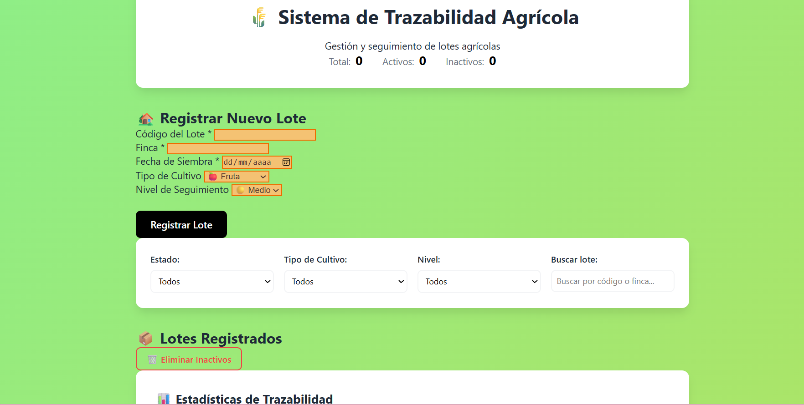

# 🌱 Sistema de Trazabilidad Agrícola

Aplicación web desarrollada en JavaScript puro (ES2023) para la gestión y seguimiento de lotes agrícolas.

Este proyecto consolida los conceptos aprendidos en Week-02 del JavaScript Moderno Bootcamp.

---

## 🎯 Dominio Implementado

Sistema de trazabilidad agrícola donde cada elemento representa un lote cultivado dentro de una finca.

La aplicación permite:

- Registrar nuevos lotes
- Gestionar su estado (activo/inactivo)
- Filtrar por cultivo y nivel de seguimiento
- Buscar por código o finca
- Visualizar estadísticas en tiempo real
- Persistir información en LocalStorage

---

## 📦 Modelo de Datos

Cada lote agrícola tiene la siguiente estructura:

```js
{
  id: Date.now(),              // Identificador único
  name: "12345",               // Código del lote
  description: "Finca La Luz", // Nombre de la finca
  active: true,                // Estado del lote
  priority: "medium",          // Nivel de seguimiento (low | medium | high)
  category: "fruta",           // Tipo de cultivo
  createdAt: "2026-03-01",     // Fecha de siembra
  updatedAt: null              // Fecha de última actualización
}

