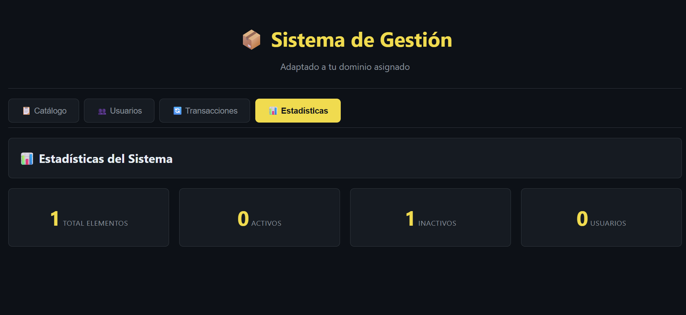

# 📦 Sistema de Gestión | Dominio: Agricultura

## 📝 Descripción del Proyecto

Este proyecto es un **sistema de gestión de elementos y usuarios** utilizando **Programación Orientada a Objetos (POO)** en **JavaScript moderno (ES2023)**.  
Está adaptado al dominio de **agricultura**, permitiendo:

- Registrar **cultivos** de diferentes tipos.
- Administrar **usuarios** con distintos roles.
- Filtrar y buscar elementos y usuarios.
- Mostrar estadísticas del sistema.
- Registrar transacciones (por ejemplo, movimiento de cultivos o actividades de usuarios).

Se estructura en **clases base y derivadas**, con **encapsulación**, **herencia**, **getters/setters**, **métodos estáticos** y **static blocks**.

---

## 🏗 Estructura del Proyecto

---

## 🧩 Clases Principales

### 1️⃣ BaseItem
- Clase base para todos los elementos (cultivos).
- Campos privados: `id`, `name`, `location`, `active`, `dateCreated`.
- Métodos:
  - `activate() / deactivate()`
  - `getInfo()`
  - `getType()`

### 2️⃣ Clases Derivadas
- `ItemType1`, `ItemType2`, `ItemType3`
- Cada clase tiene **propiedades privadas adicionales**.
- Sobrescriben `getInfo()` para mostrar datos completos.

### 3️⃣ Person
- Clase base para usuarios.
- Campos privados: `id`, `name`, `email`, `registrationDate`.
- Métodos:
  - Validación de email
  - `getInfo()`

### 4️⃣ Roles de Usuario
- `UserRole1` y `UserRole2`
- Cada rol puede tener propiedades específicas (por ejemplo, especialidad, permisos, historial de actividades).

### 5️⃣ MainSystem
- Clase principal que gestiona **items**, **usuarios** y **transacciones**.
- Características:
  - `static blocks` para configuración inicial
  - Métodos CRUD (`addItem`, `removeItem`, `findItem`, `addUser`, etc.)
  - Filtrado y búsqueda (`searchByName`, `filterByType`, `filterByStatus`)
  - Estadísticas (`getStats`)
  - IDs únicos generados con `crypto.randomUUID()`

---

## 🖥 Funcionalidades de la Interfaz

1. **Catálogo de elementos**  
   - Visualiza todos los cultivos.
   - Filtros por tipo y estado.
   - Búsqueda por nombre.
   - Botón “Agregar” para nuevos cultivos.
   - Activar/Desactivar elementos.
   - Eliminar elementos.

2. **Usuarios**
   - Registro de nuevos usuarios con rol.
   - Búsqueda por nombre/email.
   - Filtrado por rol.

3. **Transacciones**
   - Historial de movimientos o acciones del sistema.
   - Se actualiza al agregar/editar/eliminar elementos o usuarios.

4. **Estadísticas**
   - Total de elementos y usuarios.
   - Activos / Inactivos.
   - Detalle por tipo de elemento.

---

## ⚙️ Cómo Ejecutar

1. Clonar o descargar el repositorio.
2. Abrir `index.html` en un navegador moderno.
3. Interactuar con el sistema:
   - Usar el **botón + Agregar** para nuevos elementos o usuarios.
   - Cambiar entre pestañas (Catálogo, Usuarios, Transacciones, Estadísticas).
   - Aplicar filtros y búsquedas.
4. Todos los cambios se manejan **en memoria** (no persistentes en base de datos).

---

## 💻 Tecnologías Utilizadas

- HTML5
- CSS3
- JavaScript ES2023
  - Clases y herencia
  - Campos privados (#)
  - Getters y setters
  - Métodos estáticos
  - Static blocks
- DOM Manipulation

---

## 📌 Notas Importantes

- Adaptar nombres de clases y propiedades a tu **dominio específico**.
- No se permite copiar la implementación de otros compañeros.
- Todos los campos importantes están **privados** para garantizar **encapsulación**.
- La interfaz es **responsive** y modular.

---

## 🚀 Próximos Mejoras

- Persistencia de datos usando **LocalStorage o Base de Datos**.
- Autenticación de usuarios.
- Exportar informes de estadísticas y transacciones.
- Gestión avanzada de roles y permisos.

---

### 📝 Autor

- Nombre: Laura Tavera
- Curso: Técnico en Programación de Software – SENA  
- Proyecto: Sistema de Gestión con POO  
